# CS207 2023 Fall Project: Mini Piano

小组成员：何家阳、邱天润、肖淇文

> 源码放在 GitHub 项目上，将会在项目结束后开源，其链接为：[Charley-xiao/No-Genshin: No Genshin Minipiano (github.com)](https://github.com/Charley-xiao/No-Genshin)

## 开发日程安排和实施情况
### 1.团队分工及贡献占比：
何家阳：学习模式功能的构建与实现，自动模式和用户系统的实现，曲库的建立，项目视频的录制完成，项目文档的编写。

邱天润：主模块与全局控制的构建与实现，键位调整，VGA显示，LED灯管显示，项目视频的录制完成，项目文档的编写。

肖淇文：主模块与全局控制的构建与实现，手动模式和自动模式的实现，LED灯管显示，项目文档的编写。

**贡献百分比**相同，为**1:1:1**。

### 2. 开发计划日程安排
    1.项目需求分析与代码初步构建 2023/11/17~2023/11/22
    
    2.项目代码搭建，完成手动模式和自动模式 2023/11/23~2023/11/25
    
    3.学习模式实现 2023/11/26~2023/12/12
    
    4.完善功能，完成项目文档和视频工作 2023/12/13~2023/12/24
### 3. 实施情况
    1.第一次小组讨论，分析项目框架与状态图 2023/11/17
    
    2.第二次小组讨论，已完成项目代码搭建，完成手动（自由）模式和自动模式 2023/11/23~2023/11/25
    
    3.第三次小组讨论，实现七段数码管显示 2023/11/26~2023/12/2
    
    4.第四次小组讨论，VGA框架基础实现 2023/12/3~2023/12/6
    
    5.学习模式实现 2023/12/6~2023/12/12
    
    6.VGA功能实现 2023/12/13
    
    7.第五次小组讨论，完善功能，在答辩前完成功能和文档、视频的制作 2023/12/13~2023/12/25

### 4.心得
  由于各名成员学习任务重，小组采取不断集中完成模块化设计的方式逐步实现了整个项目，并在项目后期进行更详尽的分工，给予更多时间完成项目。经过整个项目的编写，我们对硬件语言有了更清晰的认识，积累了小组合作的优良经验，使每一位小组成员都受益匪浅。
## 系统功能列表与使用说明
**本项目实现了一个由EGO1控制的电子琴学习机，并具有以下功能：**

1. 根据拨码开关切换模式（00: 调整模式，01: 学习模式，10: 自动模式，11: 自由模式）。

2. 在自由模式下，可以通过拨动拨码开关演奏对应的音符，可以通过设置的拨码开关改变当前的八度（共三个八度）,并可以通过按钮改变升降调（00: 低，01: 中，10: 高）。

3. 在自动模式下，自动播放曲库中的歌曲，曲库中初始设置有4首歌曲，实现了播放不同长度的音符，歌曲会循环播放，可以通过按钮来切换歌曲或更换曲调，或者暂停/重启播放，在七段数码管展现当前歌曲编号，音符对应的led灯亮起，在VGA实现当前歌曲名称和演奏的音符。

4. 在学习模式下，可以通过按钮切换曲目和当前账号（演奏时不能更改账号），用户需要拨动led灯对应的拨码开关来实现音符的播放，当音符播放对应的时间后，会转到下一个音符，用户需要将拨码开关拨回后继续演奏。演奏每个音符获得的分数会由用户拨动拨码开关对应的间隔时间来分级，演奏过程中会实时显示分数，演奏完成后会显示评级和分数并更新当前用户的最高评级（S，A，B，C 四档）。

5. 在调整模式下，会依次播放七个音符，依次选择对应的音符，就可以改变它们的默认对应关系。

**显示模块**包括led灯的显示（演奏音符）、七段数码管的显示（歌曲编号，账户id，分数，评级），VGA的显示（歌曲名称，账户id，分数，评级）。

**输入输出**介绍如下：

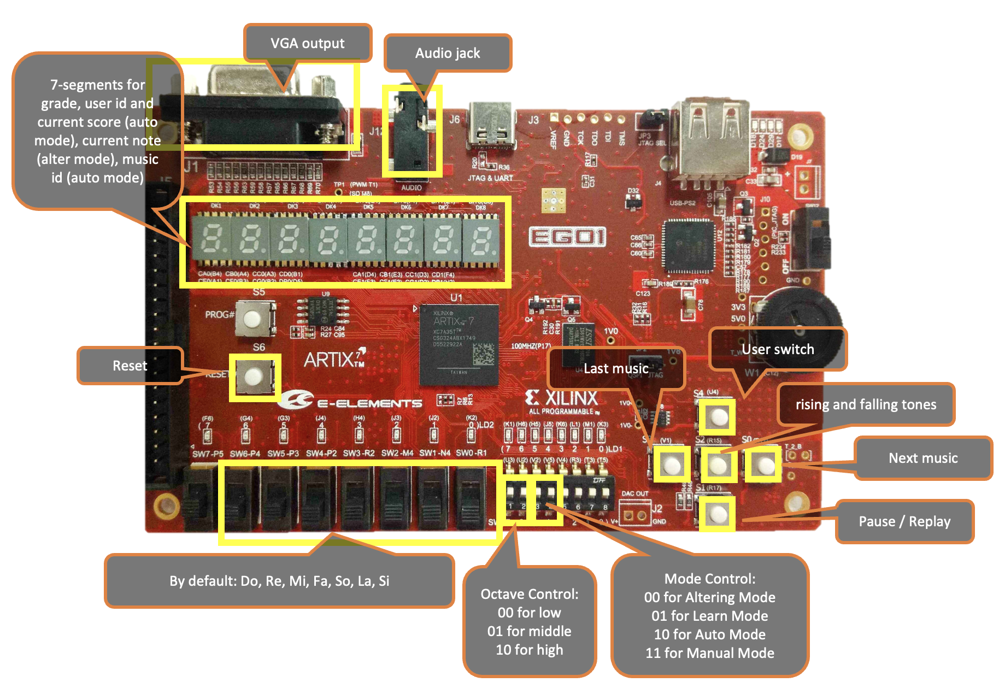

**顶层端口**如下：
| Port name   | Direction | Type       | Description          |
| ----------- | --------- | ---------- | -------------------- |
| clk         | input     | wire       | 总时钟信号           |
| sel         | input     | wire [6:0] | 选择的音符           |
| octave      | input     | wire [1:0] | 音高选择             |
| _mode       | input     | wire [1:0] | 模式选择             |
| butscale    | input     | wire       | 换音调               |
| up          | input     | wire       | 切换之后一首曲       |
| down        | input     | wire       | 切换之前一首曲       |
| user_switch | input     | wire       | 切换用户             |
| showaccount | input     | wire       | 显示用户信息         |
| speaker     | output    | wire       | 外放喇叭             |
| md          | output    | wire       | 调整音量             |
| led         | output    | [6:0]      | LED 灯管             |
| seg_out0    | output    | [7:0]      | 第一组七段数码管内容 |
| tub_sel0    | output    | [3:0]      | 第一组七段数码管控制 |
| seg_out1    | output    | [7:0]      | 第二组七段数码管内容 |
| tub_sel1    | output    | [3:0]      | 第二组七段数码管控制 |
| red         | output    | [3:0]      | VGA：红色信号        |
| green       | output    | [3:0]      | VGA：绿色信号        |
| blue        | output    | [3:0]      | VGA：蓝色信号        |
| hs          | output    | wire       | VGA：横向扫描波      |
| vs          | output    | wire       | VGA：纵向扫描波      |

并可以用下图展示：

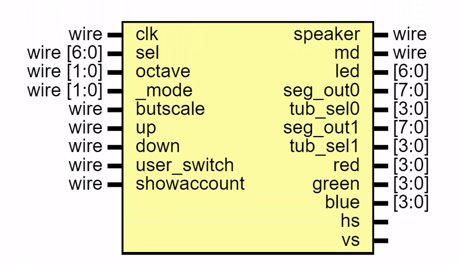

## 系统结构说明

# TODO

## 子模块功能说明

### 顶层模块：MiniPiano

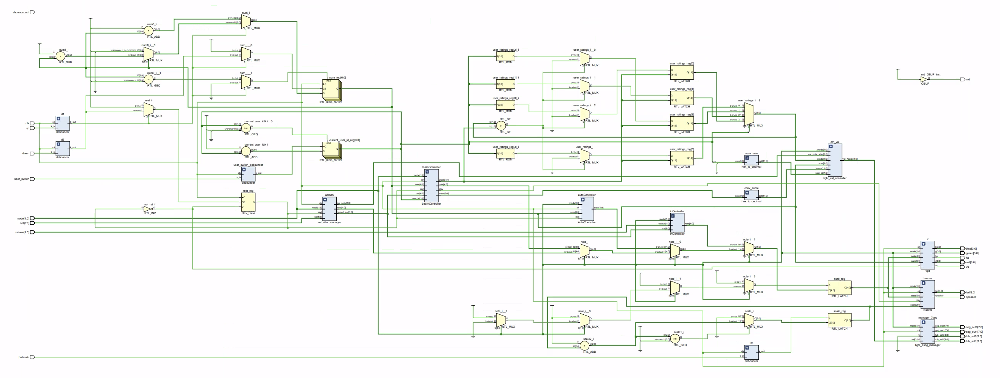

内部直接实现子模块实例：

- `hex_to_decimal`，实现从会被默认转为16进制的二进制到每四位二进制代表一个十进制数字的转换器。
- `light_val_controller`，实现对七段数码管所显示内容的统一控制。
- `light_7seg_manager`，实现对七段数码管的直接操作。
- `debouncer`，实现按键消抖。
- `sel_alter_manager`，实现选择音符的重新安排（调整模式）的设置和实际使用。
- `buzzer`，实现不同音高发音的蜂鸣器模块。
- `vga`，VGA显示的控制模块，实现当前乐曲、当前模式和当前音符的显示。
- `InController`，手动模式的控制模块。
- `AutoController`，自动模式的控制模块。
- `LearnController`，学习模式的控制模块。

### 子模块： hex_to_decimal

一般来说，将一个二进制数组每四位转为一个数，将表现为16进制。这一模块通过数字处理实现每四位代表一个10进制数字。

| Port name | Direction | Type   | Description                                               |
| --------- | --------- | ------ | --------------------------------------------------------- |
| data      | input     | [9:0]  | 输入的二进制数，最多10位                                  |
| out       | output    | [11:0] | 输出的表示10进制数的二进制表示，最多表现3位数因此有12位长 |

### 子模块：light_val_controller

这一模块根据不同的模式，解析多种输入，并输出带有格式的字符串供7段数码管模块可以直接显示。

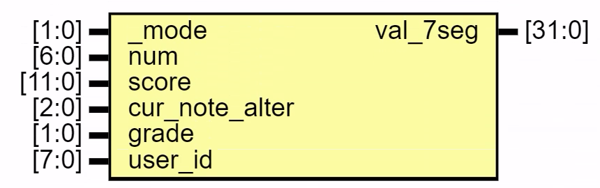

| Port name      | Direction | Type   | Description                              |
| -------------- | --------- | ------ | ---------------------------------------- |
| _mode          | input     | [1:0]  | 当前所处模式                             |
| num            | input     | [6:0]  | （自动/学习模式）当前曲子编号            |
| score          | input     | [11:0] | （学习模式）当前分数                     |
| cur_note_alter | input     | [2:0]  | （调整模式）当前在调整的对应音符         |
| grade          | input     | [1:0]  | （学习模式）评级                         |
| user_id        | input     | [7:0]  | （学习模式）用户ID                       |
| val_7seg       | output    | [31:0] | 输出的32位二进制，用于在七段数码管上输出 |

### 子模块：light_7seg_manager

直接显示`light_val_controller`模块中输出的`val_7seg`，按照FPGA要求分为两组八个七段数码管，通过极短时间内逐个设置，实现所有七段数码管的点亮。

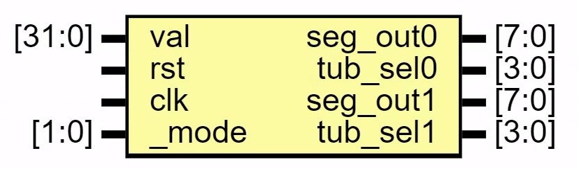

| Port name | Direction | Type   | Description                |
| --------- | --------- | ------ | -------------------------- |
| val       | input     | [31:0] | 输入的32位二进制，用于输出 |
| rst       | input     |        | 重置符号                   |
| clk       | input     |        | 时钟信号                   |
| _mode     | input     | [1:0]  | 当前所处模式               |
| seg_out0  | output    | [7:0]  | 第一组七段数码管内容       |
| tub_sel0  | output    | [3:0]  | 第一组七段数码管控制       |
| seg_out1  | output    | [7:0]  | 第二组七段数码管内容       |
| tub_sel1  | output    | [3:0]  | 第一组七段数码管控制       |

 内部实现了子模块：

- `light_7seg_ego`用于操作其中一个灯管，共两组实例，每个实例轮流操作一组中的四个七段数码管。

### 子模块：light_7seg_ego

操作其中一个灯管，根据输入在转译为7段数码管的数字。

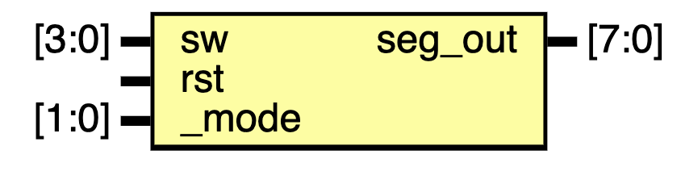

| Port name | Direction | Type  | Description         |
| --------- | --------- | ----- | ------------------- |
| sw        | input     | [3:0] | 输入的对应信息      |
| rst       | input     |       | 重置信号            |
| _mode     | input     | [1:0] | 所处模式            |
| seg_out   | output    | [7:0] | 输出的7段数码管信号 |

### 子模块：debouncer

这个模块实现了按键消抖，在`DEB_DELAY`时钟周期中只响应一次操作结果。

## 

| Port name | Direction | Type | Description        |
| --------- | --------- | ---- | ------------------ |
| clk       | input     |      | 时钟信号           |
| k_in      | input     |      | 输入的按键信号     |
| k_out     | output    | wire | 输出的消抖按键信号 |

### 子模块：sel_alter_manager

这个模块处理调整模式的设置，即依次播放7个音符，并记住所按下的对应拨码开关；以及设置完之后的处理，即所有的输入信号在这里变为解析过的`parsed_sel`信号。

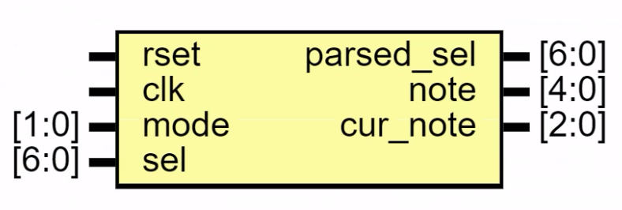

| Port name  | Direction | Type  | Description              |
| ---------- | --------- | ----- | ------------------------ |
| rset       | input     |       | 重置信号                 |
| clk        | input     | [1:0] | 时钟信号                 |
| mode       | input     | [6:0] | 当前模式，只在`00`时启动 |
| sel        | input     | [6:0] | 输入的原汁原味的音符     |
| parsed_sel | output    | [6:0] | 输出的解析过的音符       |
| note       | output    | [4:0] | 播放音符对应的音高       |
| cur_note   | output    | [2:0] | 当前正在播放的音符       |

### 子模块：buzzer

实现不同音调和音高的发声，以及对应LED的亮灭。

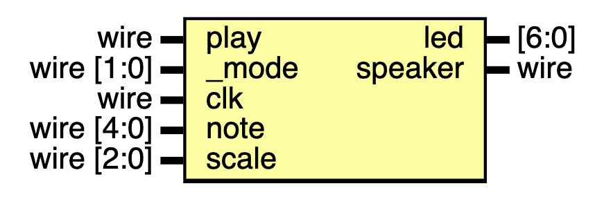

| Port name | Direction | Type       | Description      |
| --------- | --------- | ---------- | ---------------- |
| play      | input     | wire       | 是否播放音符     |
| _mode     | input     | wire [1:0] | 所处模式         |
| clk       | input     | wire       | 时钟信号         |
| note      | input     | wire [4:0] | 所播放声音的音高 |
| scale     | input     | wire [2:0] | 设置升降调       |
| led       | output    | [6:0]      | 对应LED的亮灭    |
| speaker   | output    | wire       | 扬声器播放控制   |

### 子模块：vga

这个模块实现了VGA输出，可以分在两行显示当前模式、音符和歌曲名称。

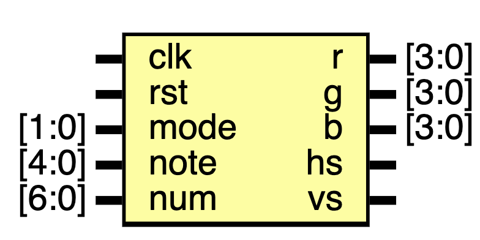

| Port name | Direction | Type  | Description      |
| --------- | --------- | ----- | ---------------- |
| clk       | input     |       | 时钟信号         |
| rst       | input     |       | 重置信号         |
| mode      | input     | [1:0] | 当前所处模式     |
| note      | input     | [4:0] | 所播放声音的音高 |
| num       | input     | [6:0] | 对应的歌曲对应ID |
| r         | output    | [3:0] | VGA的Red通道     |
| g         | output    | [3:0] | VGA的Green通道   |
| b         | output    | [3:0] | VGA的Blue通道    |
| hs        | output    |       | 横向扫描         |
| vs        | output    |       | 竖向扫描         |

实现了子模块：

- `state_data_control`，对所处在模式的解析。
- `note_data_control`，对当前音符的解析。
- `name_data_control`，对当前歌曲名称的解析。
- `char_set`，将字符解析为VGA点阵。

### 子模块：state_data_control

将当前模式信息解析为`char_set`模块可以直接处理的格式。

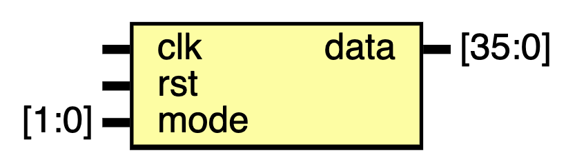

| Port name | Direction | Type   | Description |
| --------- | --------- | ------ | ----------- |
| clk       | input     |        | 时钟信号    |
| rst       | input     |        | 重置信号    |
| mode      | input     | [1:0]  | 模式        |
| data      | output    | [35:0] | 输出的信号  |

### 子模块：note_data_control

将当前音符信息解析为`char_set`模块可以直接处理的格式（2位长）。

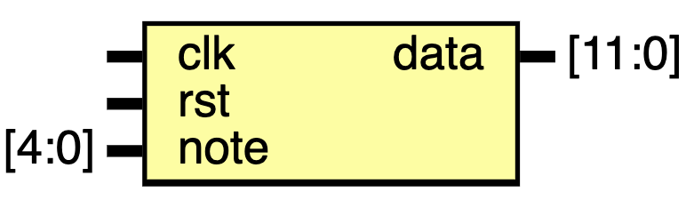

| Port name | Direction | Type   | Description |
| --------- | --------- | ------ | ----------- |
| clk       | input     |        | 时钟信号    |
| rst       | input     |        | 重置信号    |
| mode      | input     | [1:0]  | 模式        |
| data      | output    | [11:0] | 输出的信号  |

### 子模块：name_data_control

将当前音频文件名信息解析为`char_set`模块可以直接处理的格式（10位长）。

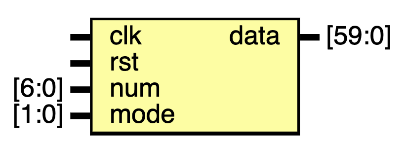

| Port name | Direction | Type   | Description |
| --------- | --------- | ------ | ----------- |
| clk       | input     |        | 时钟信号    |
| rst       | input     |        | 重置信号    |
| mode      | input     | [1:0]  | 模式        |
| data      | output    | [59:0] | 输出的信号  |

### 子模块：char_set

每个`char_set`模块将一个六位长字串解析为一个高为7格，宽为8格的点阵字符。

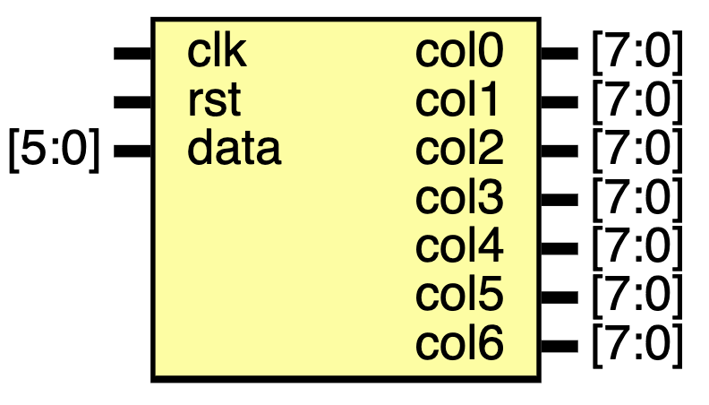

| Port name | Direction | Type  | Description   |
| --------- | --------- | ----- | ------------- |
| clk       | input     |       | 时钟信号      |
| rst       | input     |       | 复位信号      |
| data      | input     | [5:0] | 输入的数据    |
| col0      | output    | [7:0] | 输出数据第1行 |
| col1      | output    | [7:0] | 输出数据第2行 |
| col2      | output    | [7:0] | 输出数据第3行 |
| col3      | output    | [7:0] | 输出数据第4行 |
| col4      | output    | [7:0] | 输出数据第5行 |
| col5      | output    | [7:0] | 输出数据第6行 |
| col6      | output    | [7:0] | 输出数据第7行 |

### 子模块：InController

可以根据用户的需求弹奏制定的音符，并包含音高变化。

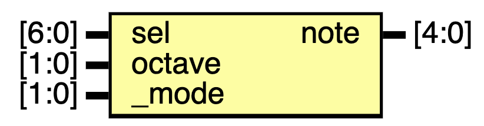

| Port name | Direction | Type  | Description    |
| --------- | --------- | ----- | -------------- |
| sel       | input     | [6:0] | 用户的当前输入 |
| octave    | input     | [1:0] | 音高设定输入   |
| _mode     | input     | [1:0] | 模式           |
| note      | output    | [4:0] | 输出音符的音高 |

### 子模块：AutoController

自动播放存储的曲子，并可以暂停、切歌等，可以播放4首不同的乐曲。

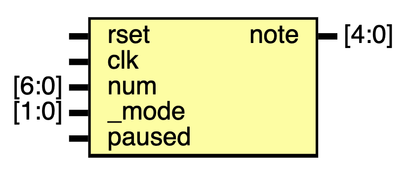

| Port name | Direction | Type  | Description        |
| --------- | --------- | ----- | ------------------ |
| rset      | input     |       | 重置信号           |
| clk       | input     |       | 时钟信号           |
| num       | input     | [6:0] | 对应的歌曲ID       |
| _mode     | input     | [1:0] | 模式               |
| paused    | input     |       | 是否暂停中         |
| note      | output    | [4:0] | 对应播放音符的音高 |

实现子模块：

- `Library`，曲库模块。

### 子模块：Library

曲库模块，存储了4首预定义乐曲。

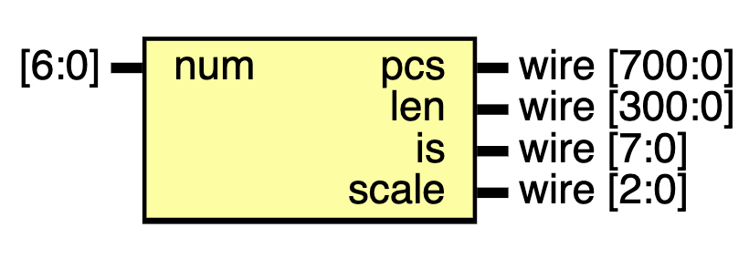

| Port name | Direction | Type         | Description                                   |
| --------- | --------- | ------------ | --------------------------------------------- |
| num       | input     | [6:0]        | 对应的歌曲ID                                  |
| pcs       | output    | wire [700:0] | 当前对应歌曲的所有音符（上限长度：700位）     |
| len       | output    | wire [300:0] | 当前对应歌曲的所有音符长度（上限长度：300位） |
| is        | output    | wire [7:0]   | 当前对应歌曲的总音数                          |
| scale     | output    | wire [2:0]   | 歌曲对应的默认音高（低/中/高）                |

### 子模块：LearnController

学习模式，不断提示用户弹奏指定长度的下一个指定音符，并可以根据是否弹奏正确和相关时间间隔，给出分数、评级。这一模块中还实现了多用户。

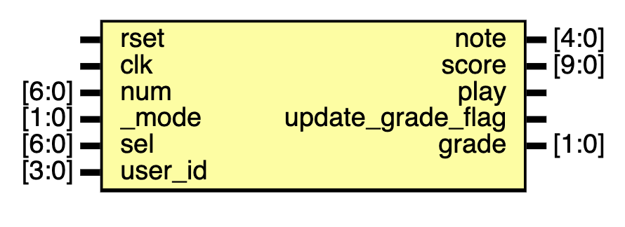

| Port name         | Direction | Type  | Description              |
| ----------------- | --------- | ----- | ------------------------ |
| rset              | input     |       | 重置信号                 |
| clk               | input     |       | 时钟信号                 |
| num               | input     | [6:0] | 当前乐曲ID               |
| _mode             | input     | [1:0] | 当前模式                 |
| sel               | input     | [6:0] | 当前用户输入音符         |
| user_id           | input     | [3:0] | 当前用户ID               |
| note              | output    | [4:0] | 输出音符音高             |
| score             | output    | [9:0] | 当前分数                 |
| play              | output    |       | 是否在播放               |
| update_grade_flag | output    |       | 更新评级，确保只更新一次 |
| grade             | output    | [1:0] | 当前用户当前曲目对应评级 |

## Bonus 实现说明

### 键位调整模式

在这一模式下（`mode==2'b00`)，先后播放七个音符，并记录所对应设置的拨码开关作为新的这种音符的对应拨码开关，记录在`parser_table[6:0]`中，具体的输入输出详见`sel_alter_manager`模块。

随后，在手动模式和学习模式中，将会将信号通过`parser_table`处理，并以`parsed_sel`的端口向外传输，实现键位的调整。

### 音频节奏的更多变化

# TODO

### 学习模式评分与时间相关

# TODO

### VGA

# TODO

### 暂停和重启（自定义Bonus）

# TODO

### 升降调（自定义Bonus）

# TODO

## 项目总结

### 遇到的一些问题与解决方案

# TODO

### 可能的远期优化

# TODO

### 心得

# TODO

## 对 Project 对想法和建议

如果我们出题，将会提供以下建议：

### 1. 游戏手柄

利用开发板实现一个全功能、高度可定制化的游戏手柄实现，并设计为可以用于操纵特定的一两款游戏，还可以具有多元的操控方案。

### 2. 智能家居终端

利用真实的传感器数据或者电脑模拟的数据，实现智能家居的自动控制，并可以手动增删新的家具，并管理各个家具的自动调整方式，如对热水器、空调自动设置温度，电动窗帘自动开合，智能门锁等进行模拟。

### 3. 真正的音乐播放器

利用纯粹的 Verilog，实现 WAV 文件的读取、解析和播放。实现以下功能：音乐解析播放，音乐 Metadata 解析，暂停/重播/切歌，文件管理。可能的Bonus：支持更多文件格式，支持流式读取来处理更大的文件。

> 灵感来源：C++ Project by Site Fan and Kangrui Chen.

### 4. 电子表

利用开发板实现电子表，并支持以下功能：显示时间，设置时区并切换多种世界时钟，计时器，秒表（支持专业体育用秒表的功能），以及闹钟。
